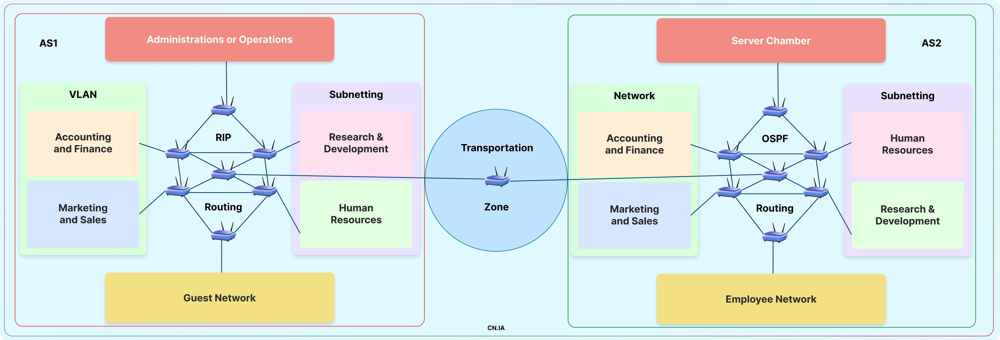

# Enterprise-Network-Architecture
A Basic Enterprise Network!!!

## This Configuration are available in this project.

- [x] RIP
- [x] OSPF
- [x] Routing Redistribution
- [x] VLAN (Using Sub-interface & Physical Link)
- [x] Subnetting (FLSM & VLSM) (Classful and Classless)
- [x] DHCP Server
- [x] Wireless LAN
- [x] DNS Server 
- [x] Web Server
- [x] FTP Server
- [x] Mail Server
- [x] Firewall

## Many More things are up coming...

- [ ] Internet
- [ ] NAT (Static & Dynamic)
- [ ] VoIP
- [ ] IOT Devices
- [ ] Cloud Computing
- [ ] Telecommunication Devices etc.....

 

 

# AS1 (RIP Routing Protocol)

### VLAN (Accounting & Finance and Marketing & Sales )
#### VLAN (Using Sub Interface - Accounting & Finance)
| VLAN Name                  | Subnet             | IP Range                | Usable Devices | Subnet Mask |
|----------------------------|--------------------|-------------------------|----------------|-------------|
| VLAN1 (Major Account)      | 192.168.0.1/24     | 192.168.0.1 - 192.168.0.254 | 253            | 255.255.255.0 |
| VLAN2 (Employees & Payroll)| 193.169.0.1/24     | 193.169.0.1 - 193.169.0.254 | 253            | 255.255.255.0 |

#### VLAN (Using Two Connections - Marketing & Sales)
| VLAN Name                   | Subnet             | IP Range                   | Usable Devices | Subnet Mask |
|-----------------------------|--------------------|----------------------------|----------------|-------------|
| VLAN1 (Business & Sales)    | 172.16.0.0/16      | 172.16.0.1 - 172.16.255.254 | 65,534         | 255.255.0.0 |
| VLAN2 (Creative & Social)   | 173.17.0.0/16      | 173.17.0.1 - 173.17.255.254 | 65,534         | 255.255.0.0 |

### Subnetting (Resources & HR)
#### Resources and Developments Department
| Subnet Name                 | Subnet             | IP Range                   | Usable Devices | Subnet Mask |
|-----------------------------|--------------------|----------------------------|----------------|-------------|
| Subnet 1 (Applied Research) | 171.2.0.0/25       | 171.2.0.1 - 171.2.0.126     | 126            | 255.255.255.128 |
| Subnet 2 (Scientific Res.)  | 171.2.0.128/25     | 171.2.0.129 - 171.2.0.254   | 126            | 255.255.255.128 |

#### Human Resource

| Subnet Name                  | Subnet            | IP Range                   | Usable Devices | Subnet Mask |
|------------------------------|-------------------|----------------------------|----------------|-------------|
| Subnet 3 (Comp. & Emp. Rel.) | 175.18.0.0/26     | 175.18.0.1 - 175.18.0.62    | 62             | 255.255.255.192 |
| Subnet 4 (Training & Rec.)   | 175.18.0.64/27    | 175.18.0.65 - 175.18.0.126  | 62             | 255.255.255.224 |

## Other Networks
| Network Name                | Subnet           | IP Range                    | Usable Devices | Subnet Mask |
|-----------------------------|------------------|-----------------------------|----------------|-------------|
| Guest Wi-Fi Network          | 192.168.4.1/24   | 192.168.4.1 - 192.168.4.254  | 253            | 255.255.255.0 |
| Administration               | 8.0.0.0/8        | 8.0.0.1 - 8.255.255.255     | 16,777,214     | 255.0.0.0 |

# AS2 (OSPF Routing Protocol)
### Networks
| Network Name                 | Subnet           | IP Range                   | Usable Devices | Subnet Mask |
|------------------------------|------------------|----------------------------|----------------|-------------|
| Network 1 (Accounting & Fin.) | 176.18.0.0/16    | 176.18.0.1 - 176.18.255.254 | 65,534         | 255.255.0.0 |
| Network 2 (Client-Social)    | 177.18.0.0/16    | 177.18.0.1 - 177.18.255.254 | 65,534         | 255.255.0.0 |

### Subnetting (Resources & HR)
#### Resources and Developments Department
| Subnet Name                | Subnet            | IP Range                   | Usable Devices | Subnet Mask |
|----------------------------|-------------------|----------------------------|----------------|-------------|
| Subnet 1 (Employee Relation)| 10.1.15.0/25      | 10.1.15.1 - 10.1.15.126    | 126            | 255.255.255.128 |
| Subnet 2 (Training & Rec.)  | 10.1.15.128/25    | 10.1.15.129 - 10.1.15.254  | 126            | 255.255.255.128 |
#### Human Resource
| Subnet Name                 | Subnet           | IP Range                   | Usable Devices | Subnet Mask |
|-----------------------------|------------------|----------------------------|----------------|-------------|
| Subnet 3 (Scientific Res.)  | 10.1.32.0/26     | 10.1.32.1 - 10.1.32.62     | 62             | 255.255.255.192 |
| Subnet 4 (Scientific Res.)  | 10.1.32.64/27    | 10.1.32.65 - 10.1.32.126   | 62             | 255.255.255.224 |

## Other Networks
| Network Name                 | Subnet           | IP Range                   | Usable Devices | Subnet Mask |
|------------------------------|------------------|----------------------------|----------------|-------------|
| Employees Network            | 192.168.1.1/24   | 192.168.1.1 - 192.168.1.254 | 253            | 255.255.255.0 |
| Server Room                  | 8.0.0.0/8        | 8.0.0.1 - 8.255.255.255     | 16,777,214     | 255.0.0.0 |
